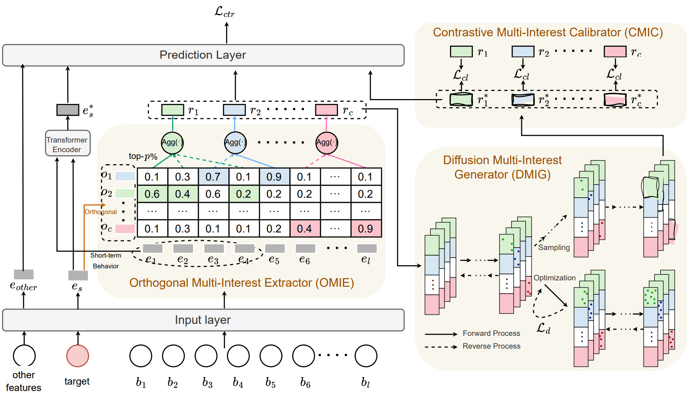

# Modeling Long-term User Behaviors with Diffusion-driven Multi-interest Network for CTR Prediction

> **A CTR model inspired by multi-interest and diffusion to model long-term user behaviors**  
> 🔗 [Paper (RecSys '25)](https://doi.org/10.1145/3705328.3748045) | 💻 [Code](https://github.com/laiweijiang/DiffuMIN)

## 🧱 Model Architecture

### DiffuMIN


#### 1. **OMIE (Orthogonal Multi-Interest Extractor)**
- Decompose target item into orthogonal interests
- **Behavior routing**: Assign each behavior to top-1 interest channel
- **Channel filtering**: Keep top-p% behaviors per channel

#### 2. **DMIG (Diffusion Multi-Interest Generator)**
- **Forward process**: Add noise to aggregated interests
- **Reverse process**: Denoise using Transformer (conditioned on context + channel)
- **Efficient sampling**: Start from `r_i,t` (not noise)

#### 3. **CMIC (Contrastive Multi-Interest Calibrator)**
- **Positive pairs**: `(r_i, r*_i)` (same user)
- **Negative pairs**: `(r_i, r*_j)` (different users)
- **Loss**: `L_cl = -log[exp(sim(r_i, r*_i)/τ) / Σ exp(sim(r_i, r*_j)/τ)]`

> 📌 Input: User behaviors + candidate  
> 📌 Output: `P(click) = σ(MLP([r, r*, e_other, e*_s]))`

## 📁 Open-Sourced Components

### ✅ 1. Core Model Code
- File: `./handle_layer/handle_lib/handle_rec_unit.py`
- Key classes:
  - `Long_term_DiffuMIN`: For industrial dataset
  - `Eleme_DiffuMIN`: For Eleme dataset

### ✅ 2. Experiment Configs
- `exp/user1/Long_term_DiffuMIN/`: Industrial config
- `exp/user1/Eleme_DiffuMIN/`: Eleme config

## 📚 Citation
```bibtex
@inproceedings{lai2025diffumin,
  title={Modeling Long-term User Behaviors with Diffusion-driven Multi-interest Network for CTR Prediction},
  author={Lai, Weijiang and Jin, Beihong and Zhang, Yapeng and Zheng, Yiyuan and Zhao, Rui and Dong, Jian and Lei, Jun and Wang, Xingxing},
  booktitle={Proceedings of the 19th ACM Conference on Recommender Systems (RecSys '25)},
  pages={289--298},
  year={2025},
  organization={ACM}
}
```

## 📬 Contact
- Email: laiweijiang22@otcaix.iscas.ac.cn
- Affiliation: Institute of Software, Chinese Academy of Sciences
- GitHub: [https://github.com/laiweijiang/DiffuMIN](https://github.com/laiweijiang/DiffuMIN)

> ⭐ **Star us if you find it useful!**

